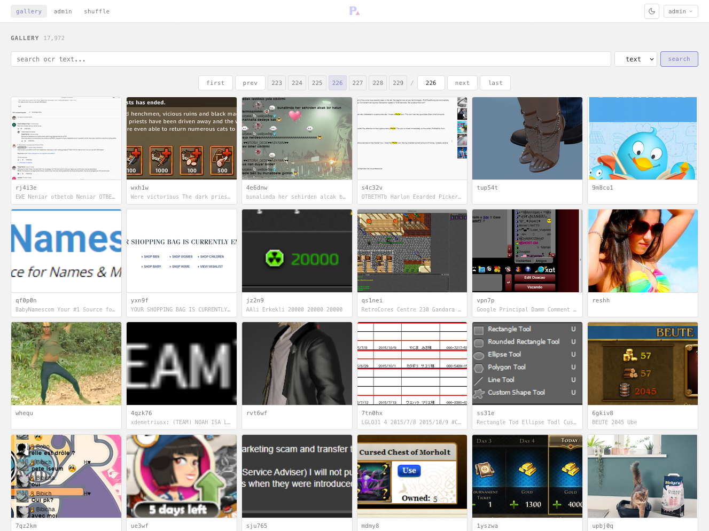
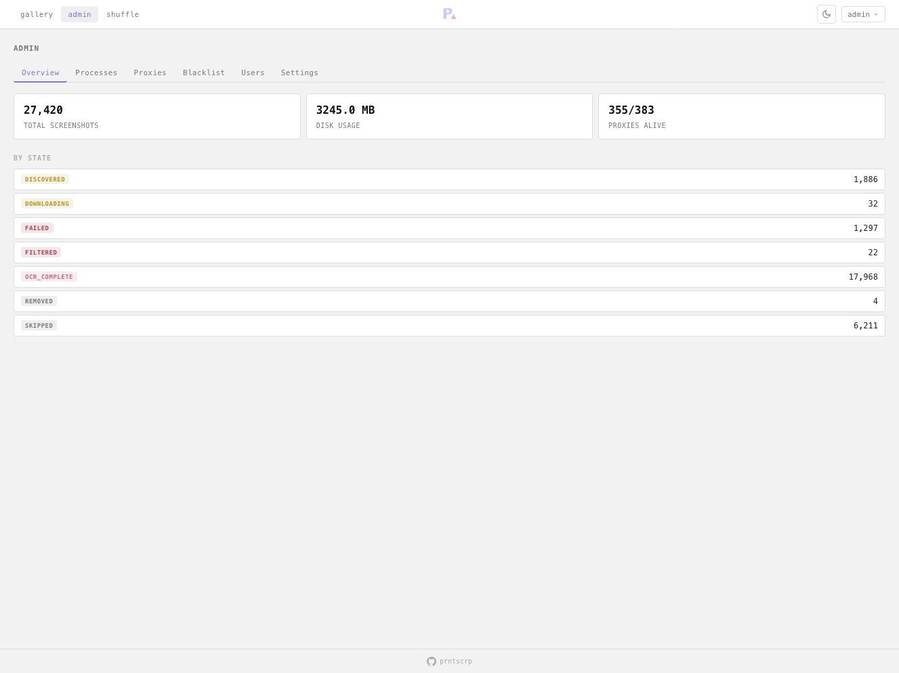

<p align="center">
  
</p>

<h1 align="center">prntscrp</h1>

<p align="center">Self-hosted screenshot archiver for <a href="https://prnt.sc">prnt.sc</a>.<br>Discovers, downloads, OCRs, and catalogs random screenshots through proxies.</p>

## Features

- **Scraper** - discovers screenshot URLs via randomized IDs through SOCKS proxies
- **Downloader** - fetches images, validates against known placeholders, deduplicates by hash
- **OCR** - extracts text from images using EasyOCR, filters against a configurable blacklist
- **Web UI** - SvelteKit frontend with gallery, lightbox, full-text + regex search, admin panel
- **Admin** - start/stop workers, manage proxies, blacklist patterns, users, and all settings from the browser
- **SQLite** - single-file database with FTS5 search, WAL mode for concurrency

## Screenshots

<details>
<summary>Gallery</summary>

</details>

<details>
<summary>Admin</summary>

</details>

## Requirements

- Python 3.10+
- Node.js 18+
- pip dependencies (see `requirements.txt`)

## Quick Start

```bash
git clone https://github.com/heheoppsy/prntscrp.git
cd prntscrp

# Install Python dependencies
pip install -r requirements.txt

# Install frontend dependencies
cd frontend && npm install && cd ..

# Start everything
./run.sh
```

Open [http://localhost:5173](http://localhost:5173). Default login is `admin` / `changeme`

## Configuration

All settings are configurable from the admin panel (Settings tab). Key options:

| Setting | Default | Description |
|---------|---------|-------------|
| `scraper_threads` | 5 | Number of scraper workers |
| `downloader_threads` | 5 | Number of download workers |
| `ocr_enabled` | true | Enable/disable OCR processing |
| `ocr_gpu` | false | Use GPU for OCR (requires CUDA) |
| `ocr_confidence_threshold` | 0.7 | Minimum OCR confidence |
| `proxy_api_url` | proxyscrape | Proxy list API endpoint |
| `blocked_hosts` | imgur, imageshack | Hosts to skip downloading from |

Settings can also be set via the database directly in the `settings` table.

## Notes

I suggest not hosting this on a VPS, most are pretty picky about web scraping and you'll probably get your service account banned.

The user account system is there if you'd like to host your archive for a few people or on your local network.  Some of the images you can grab from prnt.sc are quite questionable.

## Environment Variables

| Variable | Default | Description |
|----------|---------|-------------|
| `SECRET_KEY` | `change-me-in-production` | Flask session secret |
| `API_HOST` | `127.0.0.1` | API bind address |
| `API_PORT` | `8888` | API port |
| `PYTHON` | `python3` | Python binary for `run.sh` |

## License

[MIT](LICENSE)
